  

<strong>English</strong> · <a href="./README_CN.md">简体中文</a>

Electronic Information Engineering graduate student, turning complex workflows into useful tools. I build **Python desktop apps, automation workflows, computer vision tools and embedded systems**. Outside of code, I make photographs.

  <code>Python</code> <code>C / C++</code> <code>JavaScript</code> <code>PyQt6</code> <code>OpenCV</code> <code>STM32</code> <code>MATLAB</code>

## Selected projects

<table>
<tr>
<td width="50%" valign="top">

**[SUDA ThesisAT](https://github.com/Quartzsyr/SUDA_ThesisAT)**

Desktop thesis formatting, preview and export.

Python · PyQt6

</td>
<td width="50%" valign="top">

**[Slide → PPTX](https://github.com/Quartzsyr/slide-image-to-editable-pptx)**

Turn slide images into editable presentations.

Codex Skill · PptxGenJS

</td>
</tr>
<tr>
<td width="50%" valign="top">

**[HoleDetect](https://github.com/Quartzsyr/HoleDetect)**

Image-based hole detection and measurement.

Python · OpenCV

</td>
<td width="50%" valign="top">

**[MazeMouse](https://github.com/Quartzsyr/MazeMouse)**

Maze solving, sensing and motion control.

Embedded · Algorithms

</td>
</tr>
</table>

Also building: [DS Flowchart](https://github.com/Quartzsyr/DS_Flowchart) · [MuseFilm](https://github.com/Quartzsyr/MuseFilm)

## By the numbers

<picture>
  <source media="(prefers-color-scheme: dark)" srcset="./assets/stats-dark.svg" />
  
</picture>

<picture>
  <source media="(prefers-color-scheme: dark)" srcset="./assets/activity-dark.svg" />
  
</picture>

<picture>
  <source media="(prefers-color-scheme: dark)" srcset="./assets/languages-dark.svg" />
  
</picture>

  <picture>
    <source media="(prefers-color-scheme: dark)" srcset="./dist/github-snake-dark.svg" />
    
  </picture>

More insights · annual calendar, coding habits & community activity

Refreshed daily · Contributions follow the GitHub profile calendar; they are not commit counts.

  <a href="https://musefilm.top">Photography</a> · <a href="https://500px.com.cn/Quartz">500px</a> · <a href="https://orcid.org/0009-0003-9802-7569">ORCID</a>

