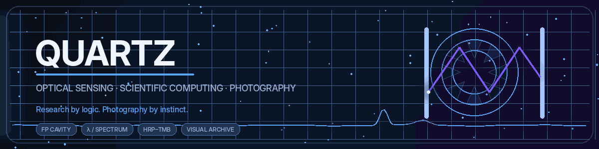
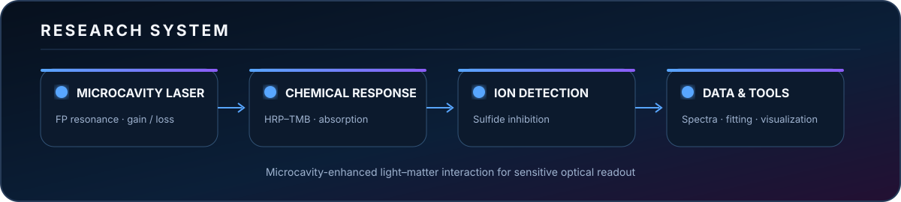

  

  <strong>English</strong>
  &nbsp;·&nbsp;
  <a href="./README_CN.md">简体中文</a>

  <a href="https://github.com/Quartzsyr"><strong>GitHub</strong></a>
  &nbsp;·&nbsp;
  <a href="https://orcid.org/0009-0003-9802-7569"><strong>ORCID</strong></a>
  &nbsp;·&nbsp;
  <a href="https://musefilm.top"><strong>MuseFilm</strong></a>
  &nbsp;·&nbsp;
  <a href="https://500px.com.cn/Quartz"><strong>500px</strong></a>

  <code>Optical Sensing</code>
  <code>Microcavity Laser</code>
  <code>Scientific Computing</code>
  <code>Embedded Systems</code>
  <code>Photography</code>

---

## About

<table>
<tr>
<td width="58%" valign="top">

### Quartz

Graduate student in **Electronic Information Engineering** working at the intersection of optical sensing, scientific computing and visual communication.

My current research focuses on microcavity-laser sensing and ion-concentration detection. I also build desktop research tools for spectral processing, experimental analysis and scientific visualization.

</td>
<td width="42%" valign="top">

### Current Focus

- Fabry–Pérot microcavity laser
- HRP–TMB reaction system
- Sulfide-ion inhibition sensing
- Spectral fitting and calibration
- Research-oriented desktop tools
- Minimalist photographic narratives

</td>
</tr>
</table>

 

## Research System

  

<strong>Measurement principle</strong>

 

The microcavity strengthens light–matter interaction and converts changes in optical loss into measurable laser-output variation. In the HRP–TMB system, sulfide ions inhibit blue-product formation. The resulting absorption change is read through the decrease of the microcavity-laser peak.

 

## Technology

  <code>Python</code>&nbsp;
  <code>MATLAB</code>&nbsp;
  <code>C</code>&nbsp;
  <code>C++</code>&nbsp;
  <code>PyQt6</code>&nbsp;
  <code>OpenCV</code>&nbsp;
  <code>STM32</code>&nbsp;
  <code>Flask</code>&nbsp;
  <code>HTML / CSS</code>&nbsp;
  <code>JavaScript</code>&nbsp;
  <code>Git</code>&nbsp;
  <code>LaTeX</code>

 

## Selected Work

<table>
<tr>
<td width="50%" valign="top">

### [HoleDetect](https://github.com/Quartzsyr/HoleDetect)

Scientific image-processing workflow for hole detection, localization and dimensional measurement.

`Python` `OpenCV` `Scientific Imaging`

</td>
<td width="50%" valign="top">

### [SUDA ThesisAT](https://github.com/Quartzsyr/SUDA_ThesisAT)

Native PyQt6 desktop tool for importing Word theses, completing cover fields, previewing PDF and exporting standardized PDF or DOCX files.

`PyQt6` `PyMuPDF` `python-docx`

</td>
</tr>
<tr>
<td width="50%" valign="top">

### [Slide Image → Editable PPTX](https://github.com/Quartzsyr/slide-image-to-editable-pptx)

A reconstruction workflow that turns slide screenshots into high-fidelity and fully editable PowerPoint files.

`Codex Skill` `PptxGenJS` `Visual Reconstruction`

</td>
<td width="50%" valign="top">

### [MazeMouse](https://github.com/Quartzsyr/MazeMouse)

Embedded maze-solving project integrating sensing, motion control and algorithm design.

`Embedded System` `Control` `Algorithms`

</td>
</tr>
<tr>
<td width="50%" valign="top">

### [DS Flowchart](https://github.com/Quartzsyr/DS_Flowchart)

Flowchart-generation software for clear algorithm, data-structure and process visualization.

`Python` `Visualization` `Developer Tool`

</td>
<td width="50%" valign="top">

### [MuseFilm](https://github.com/Quartzsyr/MuseFilm)

Photography archive and visual platform built around the Quartz creative identity.

`Photography` `Web Design` `Visual Archive`

</td>
</tr>
</table>

 

## GitHub Signals

<table>
<tr>
<td width="50%" valign="top">
<picture>
  <source media="(prefers-color-scheme: dark)" srcset="./assets/stats-dark.svg" />
  
</picture>
</td>
<td width="50%" valign="top">
<picture>
  <source media="(prefers-color-scheme: dark)" srcset="./assets/languages-dark.svg" />
  
</picture>
</td>
</tr>
</table>

  <picture>
    <source media="(prefers-color-scheme: dark)" srcset="./assets/streak-dark.svg" />
    
  </picture>

 

## Contribution Flow

  <picture>
    <source media="(prefers-color-scheme: dark)" srcset="./assets/snake-dark.svg" />
    
  </picture>

 

## Photography

<table>
<tr>
<td width="58%" valign="top">

### Visual Language

Minimal composition, restrained color and quiet observation.

Photography is not separate from engineering. Both begin with structure, measurement and attention to detail. One reads the world through signals. The other records it through light.

</td>
<td width="42%" valign="top">

### Quartz Archive

`Light` `Form` `Distance` `Silence` `Observation`

Explore the visual archive on [MuseFilm](https://musefilm.top) and [500px](https://500px.com.cn/Quartz).

</td>
</tr>
</table>

  

  Research by logic. Photography by instinct.

