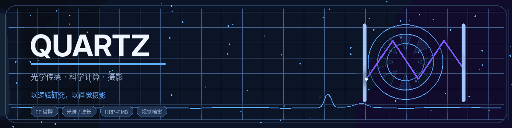
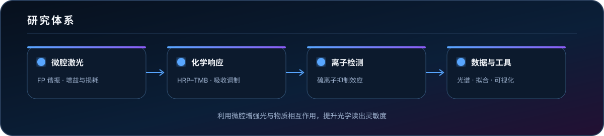
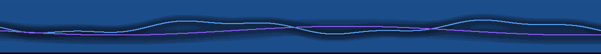

  

  <a href="./README.md">English</a>
  &nbsp;·&nbsp;
  <strong>简体中文</strong>

  <a href="https://github.com/Quartzsyr"><strong>GitHub</strong></a>
  &nbsp;·&nbsp;
  <a href="https://orcid.org/0009-0003-9802-7569"><strong>ORCID</strong></a>
  &nbsp;·&nbsp;
  <a href="https://musefilm.top"><strong>MuseFilm</strong></a>
  &nbsp;·&nbsp;
  <a href="https://500px.com.cn/Quartz"><strong>500px</strong></a>

  <code>光学传感</code>
  <code>微腔激光</code>
  <code>科学计算</code>
  <code>嵌入式系统</code>
  <code>摄影</code>

---

## 关于我

<table>
<tr>
<td width="58%" valign="top">

### Quartz

电子信息工程方向研究生，主要关注光学传感、科学计算与视觉表达。

目前的研究内容是微腔激光离子浓度检测。同时开发用于光谱处理、实验分析和科研可视化的桌面工具。

</td>
<td width="42%" valign="top">

### 当前方向

- 法布里–珀罗微腔激光
- HRP–TMB 反应体系
- 硫离子抑制效应检测
- 光谱拟合与浓度标定
- 科研桌面工具
- 极简人文摄影表达

</td>
</tr>
</table>

 

## 研究体系

  

<strong>检测原理</strong>

 

利用微腔增强光与物质相互作用，并将光学损耗变化转换为可测量的激光输出变化。在 HRP–TMB 体系中，硫离子会抑制蓝色产物形成。由此产生的吸收变化可通过微腔激光峰值下降量进行读取。

 

## 技术栈

  <code>Python</code>&nbsp;
  <code>MATLAB</code>&nbsp;
  <code>C</code>&nbsp;
  <code>C++</code>&nbsp;
  <code>PyQt6</code>&nbsp;
  <code>OpenCV</code>&nbsp;
  <code>STM32</code>&nbsp;
  <code>Flask</code>&nbsp;
  <code>HTML / CSS</code>&nbsp;
  <code>JavaScript</code>&nbsp;
  <code>Git</code>&nbsp;
  <code>LaTeX</code>

 

## 代表项目

<table>
<tr>
<td width="50%" valign="top">

### [HoleDetect](https://github.com/Quartzsyr/HoleDetect)

面向科研与工业图像的孔洞检测、定位和尺寸测量工具。

`Python` `OpenCV` `科学图像处理`

</td>
<td width="50%" valign="top">

### [SUDA ThesisAT](https://github.com/Quartzsyr/SUDA_ThesisAT)

基于 PyQt6 的原生论文桌面工具，支持 Word 导入、封面字段补全、PDF 实时预览，以及标准化 PDF 和 DOCX 导出。

`PyQt6` `PyMuPDF` `python-docx`

</td>
</tr>
<tr>
<td width="50%" valign="top">

### [Slide Image → Editable PPTX](https://github.com/Quartzsyr/slide-image-to-editable-pptx)

将幻灯片截图重建为高保真、可编辑 PowerPoint 文件的完整工作方法。

`Codex Skill` `PptxGenJS` `视觉重建`

</td>
<td width="50%" valign="top">

### [MazeMouse](https://github.com/Quartzsyr/MazeMouse)

结合传感、运动控制和算法设计的嵌入式迷宫小车项目。

`嵌入式系统` `控制` `算法`

</td>
</tr>
<tr>
<td width="50%" valign="top">

### [DS Flowchart](https://github.com/Quartzsyr/DS_Flowchart)

用于算法、数据结构和流程表达的流程图生成与可视化工具。

`Python` `可视化` `开发工具`

</td>
<td width="50%" valign="top">

### [MuseFilm](https://github.com/Quartzsyr/MuseFilm)

围绕 Quartz 个人视觉身份建立的摄影档案和作品展示平台。

`摄影` `网页设计` `视觉档案`

</td>
</tr>
</table>

 

## GitHub 数据

<table>
<tr>
<td width="50%" valign="top">
<picture>
  <source media="(prefers-color-scheme: dark)" srcset="./assets/stats-dark.svg" />
  
</picture>
</td>
<td width="50%" valign="top">
<picture>
  <source media="(prefers-color-scheme: dark)" srcset="./assets/languages-dark.svg" />
  
</picture>
</td>
</tr>
</table>

  <picture>
    <source media="(prefers-color-scheme: dark)" srcset="./assets/streak-dark.svg" />
    
  </picture>

 

## 贡献动画

  <picture>
    <source media="(prefers-color-scheme: dark)" srcset="./assets/snake-dark.svg" />
    
  </picture>

 

## 摄影

<table>
<tr>
<td width="58%" valign="top">

### 视觉语言

克制的构图、安静的色彩和对日常细节的观察。

摄影并不独立于工程研究。两者都从结构、测量和细节开始。一个通过信号理解世界，另一个通过光记录世界。

</td>
<td width="42%" valign="top">

### Quartz 视觉档案

`光` `形态` `距离` `安静` `观察`

在 [MuseFilm](https://musefilm.top) 和 [500px](https://500px.com.cn/Quartz) 查看摄影作品。

</td>
</tr>
</table>

  

  以逻辑研究，以直觉摄影。

